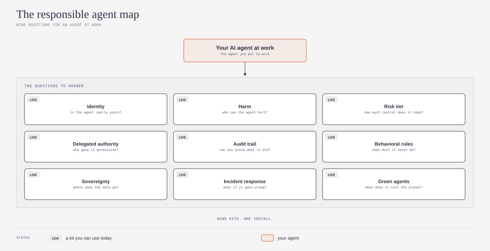

# agent-governance-kit

## What is it?

This repository is the front door to a set of plain-language kits for the governance of AI agents at work. Each kit explains one governance question in simple words. Each kit also gives an agent skill that your AI agent can use with you. This repository links the kits together, and it gives you a place to start.



*Do you want the technical words in plain English? Refer to the [Jargon Buster](JARGON.md).*

## What problem does it solve?

When you put an AI agent to work, it can act for you, use your data, and affect other people. Most guidance on agent governance is long and written for specialists. This kit tells you which questions to answer first, and it points you to a short guide for each question.

## Who is it for?

This kit is for small teams and solo builders who put AI agents into real work. You do not need to be a risk specialist. A checklist for personal agents is planned if people ask for it.

## Start here

Answer the five questions in [START-HERE.md](START-HERE.md). Each answer points you to the correct kit. Then use the one-page [CHECKLIST.md](CHECKLIST.md).

## What is in the kit?

| Question | Kit | Status |
|---|---|---|
| Identity: is the agent really yours? | [agent-name-assurance-explained](https://github.com/ams-builds/agent-name-assurance-explained) | Live |
| Harm: who can the agent hurt? | [rahp-toolkit-explained](https://github.com/ams-builds/rahp-toolkit-explained) | Live |
| Risk tier: how much control does it need? | [dpi-ai-governance-explained](https://github.com/ams-builds/dpi-ai-governance-explained) | Live |
| Delegated authority: who gave it permission? | Not yet | Coming |
| Audit trail: can you prove what it did? | Not yet | Coming |
| Behavioral rules: what must it never do? | Not yet | Coming |
| Sovereignty: where does the data go? | Not yet | Coming |
| Incident response: what if it goes wrong? | Not yet | Coming |

## How to install

The skills use the open [Agent Skills](https://agentskills.io) format, so they work with many AI agents.

### One command for all agents

If you have Node.js, run these commands in a terminal. Each command installs one skill for Claude Code, Codex, GitHub Copilot, and other agents.

```
npx skills add ams-builds/agent-name-assurance-explained
npx skills add ams-builds/rahp-toolkit-explained
npx skills add ams-builds/dpi-ai-governance-explained
```

To get the latest versions later, run `npx skills update`. The commands use [skills](https://github.com/vercel-labs/skills) by [Vercel](https://github.com/vercel-labs).

### Claude

Each kit has the steps for Claude in its "How to install" section: [identity](https://github.com/ams-builds/agent-name-assurance-explained#claude), [harm](https://github.com/ams-builds/rahp-toolkit-explained#claude), [risk tier](https://github.com/ams-builds/dpi-ai-governance-explained#claude).

### Codex

Each kit has the steps for Codex in its "How to install" section: [identity](https://github.com/ams-builds/agent-name-assurance-explained#codex), [harm](https://github.com/ams-builds/rahp-toolkit-explained#codex), [risk tier](https://github.com/ams-builds/dpi-ai-governance-explained#codex).

### GitHub Copilot

Each kit has the steps for GitHub Copilot in its "How to install" section: [identity](https://github.com/ams-builds/agent-name-assurance-explained#github-copilot), [harm](https://github.com/ams-builds/rahp-toolkit-explained#github-copilot), [risk tier](https://github.com/ams-builds/dpi-ai-governance-explained#github-copilot).

## How to use it

1. Answer the questions in [START-HERE.md](START-HERE.md).
2. Open the kits that your answers point to.
3. Tell your AI agent to run the skill of each kit on your agent. For example: "Do a harm check on my agent."
4. Use [CHECKLIST.md](CHECKLIST.md) to record what you did and what is still open.

## Bigger organizations

This kit is for small teams. When you outgrow this kit, refer to the [Agent Governance Toolkit](https://github.com/microsoft/agent-governance-toolkit) by [Microsoft](https://github.com/microsoft). It is an open-source toolkit that applies policy to each action of an agent while the agent runs.

## Credit and license

The three live kits are based on open work by [Sankarshan Mukhopadhyay](https://github.com/sankarshanmukhopadhyay). The harm kit also uses the work of the Risk Assessment and Harms Prevention Task Force in [Trust Over IP](https://github.com/trustoverip/dtgwg-rahp-tf). This repository is an independent project. It is not an official part of these source projects.

All text in this repository is original and uses the [MIT License](LICENSE). Each kit keeps its own license. Refer to the kit for its license.

**Language.** I wrote the text in Simplified Technical English (ASD-STE100). The idea to ask an AI model to write in ASD-STE100 comes from [Andrej Karpathy](https://github.com/karpathy) ([his post on X](https://x.com/karpathy/status/2105819303471976479)). I used the [simplified-technical-english](https://github.com/0xpili/simplified-technical-english) agent skill by [pili](https://github.com/0xpili) to write and check the text. ASD-STE100 is a specification of ASD (AeroSpace and Defence Industries Association of Europe). This repository is not related to ASD.

---

*New words? The [Jargon Buster](JARGON.md) gives plain-English explanations of governance, risk tier, delegated authority, audit trail, sovereignty, and more.*
